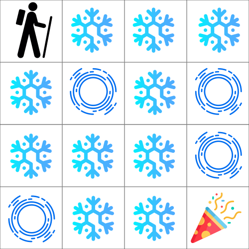

# Bachelor Training: Learning DQN

## Solution version

## Installation

_We assume that you are using a Linux OS and are using python3_

The first thing you need to do is to fork this repo. Once that is done you can create a new Python virtual env in your home directory:
```shell
$ cd
$ python3 -m venv LearningDQNEnv
```
To activate it run 
```shell
$ source ~/LearningDQNEnv/bin/activate
```
You will install the required Python packages now by running the following command in the `learning-dqn` directory:
```shell
$ pip install -r requirements.txt
```
You can now move to the next part ! Do not forget to activate your python environment :)

## Q-Learning

In this first exercise you will learn to code the Q-Learning algorithm [1].

### Frozen Lake



We use the implementation of the FrozenLake environment from OpenAI's Gym, where it is described as follows:


    Winter is here. You and your friends were tossing around a frisbee at the park 
    when you made a wild throw that left the frisbee out in the middle of the lake. 
    The water is mostly frozen, but there are a few holes where the ice has melted. 
    If you step into one of those holes, you'll fall into the freezing water. At 
    this time, there's an international frisbee shortage, so it's absolutely 
    imperative that you navigate across the lake and retrieve the disc. However, 
    the ice is slippery, so you won't always move in the direction you intend. 
    The surface is described using a grid like the following

        SFFF
        FHFH
        FFFH
        HFFG

    S : starting point, safe
    F : frozen surface, safe
    H : hole, fall to your doom
    G : goal, where the frisbee is located

    The episode ends when you reach the goal or fall in a hole.
    You receive a reward of 1 if you reach the goal, and zero otherwise.


The agent can move in the 4 directions (0: Left; 1: Down; 2: Right; 3: Up). However, the action has only a probability of `1/3` to succeed! With probability `2/3` the agent will move in one of the two 'perpendicular' directions (1/3 each). The agent does not know the randomness of the environment (it needs to discover this by interaction).

To give you an example, if your agent selects action `0`, the environment implements action `LEFT`, but since the environment is also stochastic, there is a `33%` chance of actually going left, a `33%` chance of going up, and a `33%` chance of going down. There is `0%` chance of going in the reverse direction, in this case RIGHT. If you run into a wall, you stay in the same place.

### The code

There are two files in the q-learning directory:
- `agent.py`: contains the Q-Learner agent class. This is where you should write the q-learning code.
- `runner.py`: contains the RL training loop. It is already implemented but make sure to read it carefully to understand how it works. You need to write some code to plot the results of `train`. 

The exploration you should implement is a decaying epsilon greedy strategy. At the end of each learning episode (`training=True`) you should multiply the current value of epsilon with the epsilon decay rate, however keep in mind that epsilon should not be less than `epsilon_min` ! 

Parameters:
* `learning rate`: 0.01
* `gamma`: 0.99
* `(epsilon_max, epsilon_min, epsilon_decay)`: (1.0, 0.05, 0.99)
* `num_episodes`: 30000
* `evaluate_every`: 1000
* `num_evaluation_episodes`: 32

## DQN

### Cartpole


Cartpole is a classic RL environment, the description from OpenAI's gym is:

    A pole is attached by an un-actuated joint to a cart, which moves along 
    a frictionless track. The system is controlled by applying a force of 
    +1 or -1 to the cart. The pendulum starts upright, and the goal is to 
    prevent it from falling over. A reward of +1 is provided for every 
    timestep that the pole remains upright. The episode ends when the pole 
    is more than 15 degrees from vertical, or the cart moves more than 2.4 
    units from the center.

### The code
There are 3 files:
* `runner.py`: same as before;
* `model.py`: contains the neural network;
* `agent.py`: the agent that uses neural network approximation.

Parameters:
* `learning rate`: 0.01
* `gamma`: 0.99
* `(epsilon_max, epsilon_min, epsilon_decay)`: (1.0, 0.05, 0.99)
* `num_episodes`: 1000
* `evaluate_every`: 50
* `num_evaluation_episodes`: 32


## How to plot

Whenever you need to plot the result of an RL algorithm there are a couple of things to keep in mind:
- You should always run your experiments at least `5` times on different seeds.
- The plots should display the mean over the different seeds with standard deviation.
- Do not plot the discounted cumulative return of each training episode but instead make bins of `100` episodes, for instance, and use the average of those `100` episodes as a unique data point.
